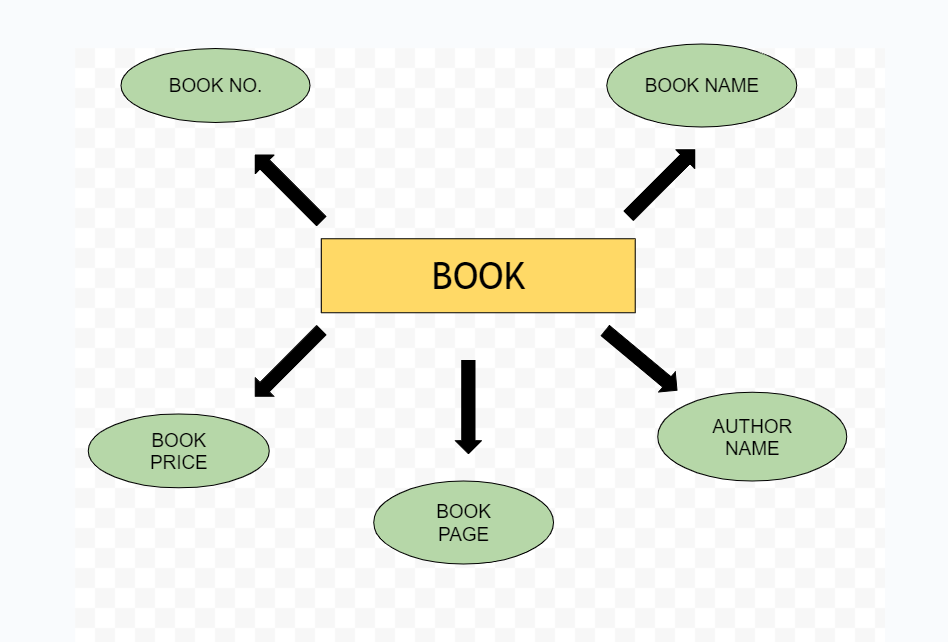

# Ex02 Django ORM Web Application
## Date: 

## AIM
To develop a Django application to store and retrieve data from a Book database using Object Relational Mapping(ORM).

## Entity Relationship Diagram

## DESIGN STEPS

### STEP 1:
Clone the problem from GitHub

### STEP 2:
Create a new app in Django project

### STEP 3:
Enter the code for admin.py and models.py

### STEP 4:
Execute Django admin and create details for 10 books

## PROGRAM

'''
admin.py

from django.contrib import admin
from .models import book,bookAdmin
admin.site.register(book,bookAdmin)  

models.py

from django .db import models
from django.contrib import admin
class book(models.Model):
     book_no=models.IntegerField(primary_key=True)
     book_name=models.CharField(max_length=20)
     author_name=models.CharField(max_length=30)
     book_page=models.IntegerField()
     book_price=models.IntegerField()
     
class bookAdmin(admin.ModelAdmin):
    list_display=('book_no','book_name','author_name','book_page','book_price')
'''

## OUTPUT

## RESULT
Thus the program for creating a database using ORM hass been executed successfully
